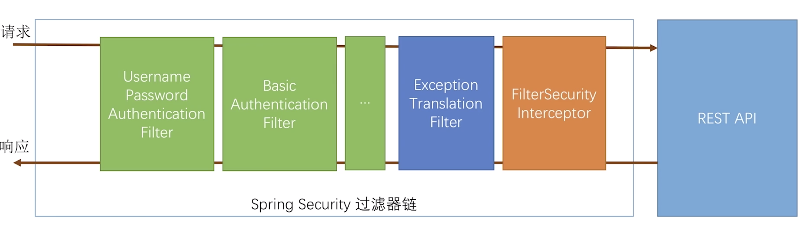
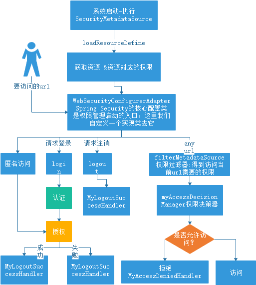
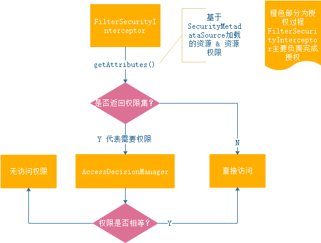
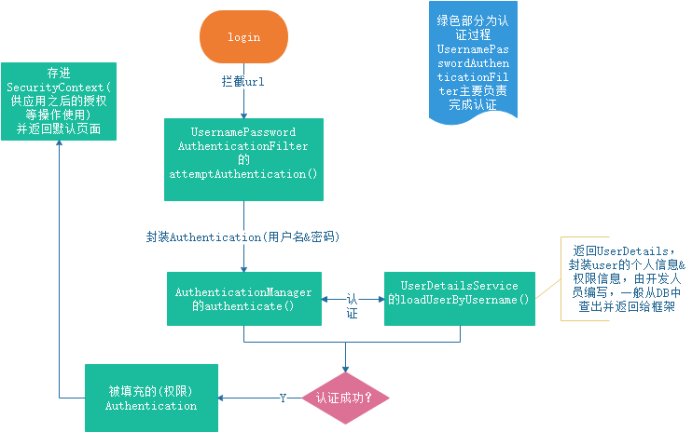

## spring security

一个能够为基于Spring的企业应用系统提供声明式的安全訪问控制解决方式的安全框架（简单说是对访问权限进行控制）。

应用的安全性包括用户认证（Authentication）和用户授权（Authorization）两个部分。

用户认证指的是验证某个用户是否为系统中的合法主体，也就是说用户能否访问该系统。

用户认证一般要求用户提供用户名和密码。系统通过校验用户名和密码来完成认证过程。

用户授权指的是验证某个用户是否有权限执行某个操作。在一个系统中，不同用户所具有的权限是不同的。

比如对一个文件来说，有的用户只能进行读取，而有的用户可以进行修改。

一般来说，系统会为不同的用户分配不同的角色，而每个角色则对应一系列的权限。   

spring security的主要核心功能为 认证和授权，所有的架构也是基于这两个核心功能去实现的。

## 核心类

springSecurity在我们进行用户认证以及授予权限的时候，通过各种各样的拦截器来控制权限的访问，从而实现安全。

spring Security功能的实现主要是由一系列过滤器链相互配合完成。

由上图可以看到，Spring Security其实就是个过滤器链，有很多过滤器 

**UsernamePasswordAuthenticationFilter**是用来做表单认证过滤的；

如果没有配置表单认证，而是Basic认证，则过滤器**BasicAuthenticationFilter**会发挥作用。

**FilterSecurityInterceptor**则是最后一个过滤器，是用来根据前面的过滤器是否生效以及生效的结果来判断你请求是否可以访问REST接口。

如果无法通过FilterSecurityInterceptor则会抛出异常。而**ExceptionTranslationFilter**会捕获抛出的异常来进行相应的处理。

### 用户认证核心类

    SecurityContextHolder：提供对SecurityContext的访问
    SecurityContext：持有Authentication对象和其他可能需要的信息
    
    Authentication：Spring Security方式的认证主体
    GrantedAuthority：对认证主题的应用层面的授权，含当前用户的权限信息，通常使用角色表示
    
    AuthenticationManager：可以包含多个AuthenticationProvider
    
    ProviderManager：为AuthenticationManager接口的实现类
    
    AuthenticationProvider：主要用来进行认证操作的类 调用其中的authenticate()方法去进行认证操作
    
    UserDetailsService：通过username构建UserDetails对象，通过loadUserByUsername根据userName获取UserDetail对象
    
    UserDetails：构建Authentication对象必须的信息，可以自定义，可能需要访问DB得到
    
### 用户授权核心类

    FilterInvocationSecurityMetadataSource：调用getAttributes()来进行资源匹配。
    它会读取数据库resource表中的所有记录，对/xxx进行匹配。
    若匹配成功，则将/xxx对应所需的角色组成Collection<ConfigAttribute>返回；
    若匹配不成功则说明/xxx不需要什么额外的访问权限。
    
    AccessDecisionManager：鉴权的决策类，decide()可以决定当前用户是否能够访问资源。
    
## 核心流程

### 工作流程

### 授权流程

### 认证流程

